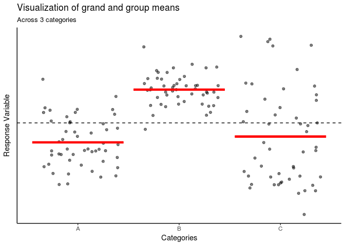
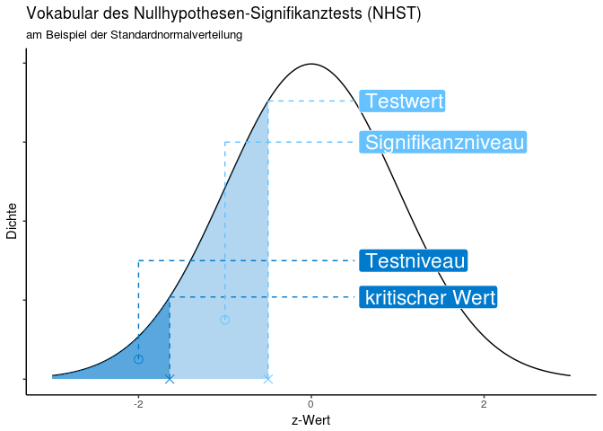
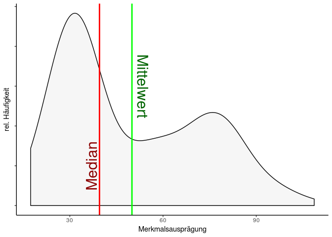
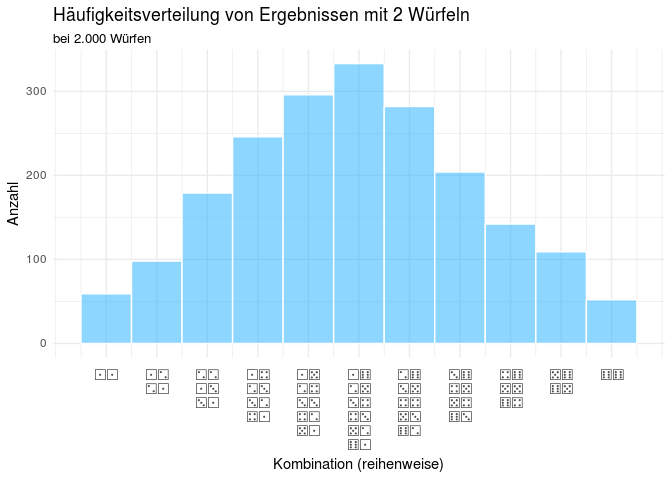
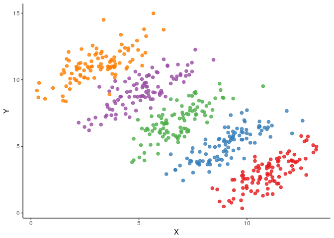
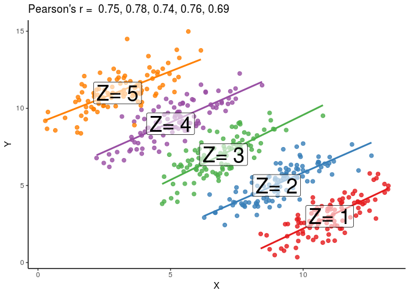

Showcase
================
Tadaa!
2018-04-23

Here are a few plots useful for teaching.

*η*<sup>2</sup>: Group & grand mean
-----------------------------------

``` r
library(ggplot2)

data <- data.frame(groups = c(rep("A", 50), rep("B", 50), rep("C", 50)),
                   y = c(rnorm(50, 10, 1.5), rnorm(50, 13, 1), rnorm(50, 11, 3)))

ggplot(data = data, aes(x = groups, y = y)) +
  geom_jitter(alpha = .5) +
  stat_summary(fun.ymax = mean, fun.ymin = mean,
               geom = "errorbar", color = "red", size = 1.5) +
  geom_hline(aes(yintercept = mean(y)), lty = "dashed") +
  labs(title = "Visualization of grand and group means",
       subtitle = "Across 3 categories",
       x = "Categories", y = "Response Variable") +
  theme_classic() +
  theme(axis.text.y = element_blank(),
        axis.ticks.y = element_blank())
```



*Literary Digest* Poll Debacle
------------------------------

``` r
litdig <- readRDS("./data/literary_digest.rds")

ggplot() +
  geom_polygon(data = litdig, aes(x = long, y = lat, group = group, fill = winner_ld,
                                 alpha = ifelse(AML_ld > FDR_ld, AML_p_ld, FDR_p_ld))) +
  geom_path(data = litdig, aes(x = long, y = lat, group = group),
            color = "black", size = 0.1) +
  scale_fill_brewer(palette = "Set1") +
  scale_alpha_continuous(range = c(0.3, 0.9), labels = scales::percent_format()) +
  scale_x_continuous(labels = NULL, breaks = NULL) +
  scale_y_continuous(labels = NULL, breaks = NULL) +
  coord_map() +
  labs(title = "Das Literary Digest Umfrage-Desaster von 1936",
       subtitle = "Die Schätzung von Literary Digest",
       x = NULL, y = NULL, alpha = "Stimmanteil",
       fill = "Sieger", caption = "n = ca. 2.3 Mio") +
  hrbrthemes::theme_ipsum(axis = FALSE, ticks = FALSE)
```

    ## Warning: Removed 1 rows containing missing values (geom_path).


``` r
ggplot() +
  geom_polygon(data = litdig, aes(x = long, y = lat, group = group, fill = winner_rl,
                                 alpha = ifelse(AML_rl > FDR_rl, AML_p_rl, FDR_p_rl))) +
  geom_path(data = litdig, aes(x = long, y = lat, group = group),
            color = "black", size = 0.1) +
  scale_fill_brewer(palette = "Set1") +
  scale_alpha_continuous(range = c(0.3, 0.9), labels = scales::percent_format()) +
  scale_x_continuous(labels = NULL, breaks = NULL) +
  scale_y_continuous(labels = NULL, breaks = NULL) +
  coord_map() +
  labs(title = "Das Literary Digest Umfrage-Desaster von 1936",
       subtitle = "Der tatsächliche Wahlausgang",
       x = NULL, y = NULL, alpha = "Stimmanteil",
       fill = "Sieger", caption = "n = ca. 44.4 Mio") +
  hrbrthemes::theme_ipsum(axis = FALSE, ticks = FALSE)
```

    ## Warning: Removed 1 rows containing missing values (geom_path).


NHST-Vokabeln
-------------

``` r
nr <- tibble(
  x = seq(-3, 3, .01),
  y = dnorm(x)
)

mymarks <- tibble(
  y    = c(0, .075, 0, .025),
  yend = c(dnorm(-.5), .3, dnorm(-1.64), .15),
  x    = c(-.5, -1, -1.64, -2),
  xend = rep(.5, 4),
  Begriff = c("Testwert", "Signifikanzniveau", "kritischer Wert", "Testniveau")
)

cols <- c("#66c2ff", "#66c2ff", "#007acc", "#007acc")

ggplot(nr, aes(x, y)) +
  geom_line() +
  geom_ribbon(data = subset(nr, x <= -1.64),
              aes(ymax = y, ymin = 0), fill = "#007acc", alpha = .5) +
  geom_ribbon(data = subset(nr, x <= -.5),
              aes(ymax = y, ymin = 0), fill = "#007acc", alpha = .3) +
  geom_segment(data = mymarks, aes(xend = xend, y = yend, yend = yend), linetype = "dashed",
               color = cols) +
  geom_segment(data = mymarks, aes(xend = x, yend = yend), linetype = "dashed",
               color = cols) +
  geom_point(data = mymarks, aes(x = x, y = y), shape = c(4, 1, 4, 1), size = 3,
             color = cols) +
  geom_label(data = mymarks, aes(label = Begriff, x = .55, y = yend), color = "white",
             hjust = "outward", fill = cols, size = 6) +
  scale_y_continuous(labels = NULL) +
  labs(title = "Vokabular des Nullhypothesen-Signifikanztests (NHST)",
       subtitle = "am Beispiel der Standardnormalverteilung",
       x = "z-Wert", y = "Dichte") +
  hrbrthemes::theme_ipsum_tw(grid = FALSE)
```



Yerkes-Dodson Gesetz
--------------------

...und nichtlineare Zusammenhänge im allgemeinen.

``` r
p <- .5
q <- seq_len(100)
y <- (1200 - p * (q - 50)^2) / 12
y_noise  <- y + rnorm(length(q), 10, 7.5)
y_min    <- min(y_noise)
y_max    <- max(y_noise)
rsq_lm   <- round(cor(y_noise, q)^2, 3)
rsq_poly <- round(summary(lm(y_noise ~ poly(q, 2)))$r.squared, 3)

ggplot(NULL, aes(q, y_noise)) +
  geom_jitter(height = 0, width = 0, shape = 21, size = 2) +
  geom_smooth(method = lm, color = "#e60000", se = FALSE, linetype = "dashed") +
  geom_smooth(method = lm, formula = y ~ poly(x, 2), color = "#00cc44", se = FALSE) +
  geom_label(aes(x = 37.5, y = 65), color = "#e60000", size = 5,
             label = paste("linear:\nR² =", rsq_lm)) +
  geom_label(aes(x = 70, y = 60), color = "#009933", size = 5,
             label = paste("quadr.:\nR² =", rsq_poly)) +
  scale_y_continuous(breaks = c(seq(y_min, y_max, (y_max - y_min) / 5)),
                     labels = c("niedrig", rep("", 4), "hoch")) +
  scale_x_continuous(breaks = c(seq(0, 100, 25)),
                     labels = c("niedrig", rep("", 3),"hoch")) +
  labs(
    title = "Das Yerkes-Dodson-Gesetz",
    x = "Stressniveau / Erregung",
      y = "Leistungsfähigkeit"
  ) +
  theme_classic()
```


Gesetz der Großen Zahl
----------------------

``` r
library(purrr)
library(dplyr)
library(ggplot2)
library(scales)

map_dbl(seq_len(1200), function(x) {
  wurf <- sample(c(1:6), x, replace = T)

  length(wurf[wurf == 6]) / length(wurf)
}) %>%
  data.frame(
    Wurfse = seq_along(.),
    Prob   = .
  ) %>%
  ggplot(aes(x = Wurfse, y = Prob)) +
    geom_point(size = .75, alpha = .3) +
    geom_hline(aes(yintercept = 1/6), size = .5, color = "red") +
    labs(title = "Das Gesetz der großen Zahl",
         subtitle = "Häufigkeit eines 6er-Wurfs bei 1200 Würfen",
         y = "rel. Häufigkeit", x = "Würfe") +
    annotate("label", x = 1000, y = .25, label = "erwartete Häufigkeit", alpha = .8,
             fill = "red", color = "white", size = 4, label.padding = unit(.35, "lines")) +
    scale_x_continuous(breaks = pretty_breaks())
```


Mittelwert und Median
---------------------

Allgemeine Hügeligkeit als solche.

``` r
zwei <- c(rnorm(100, 30, 5), rnorm(100, 70, 15))

ggplot() +
  geom_density(aes(x = zwei), fill = "light gray", alpha = .2) +
  geom_vline(xintercept = median(zwei), color = "red", size = 1) +
  geom_vline(xintercept = mean(zwei), color = "green", size = 1) +
  geom_text(aes(x = 37, y = .005), label = "Median", 
            color = "dark red", angle = 90, size = 8) +
  geom_text(aes(x = 53.5, y = .015), label = "Mittelwert", 
            color = "dark green", angle = -90, size = 8) +
  scale_y_continuous(breaks = pretty_breaks(), labels = NULL) +
  labs(x = "Merkmalsausprägung", y = "rel. Häufigkeit")
```



Normalverteilung: Extraversion
------------------------------

``` r
library(ggplot2)

# label_norm shamelessly ripped off from Lukas Burk (jemus42)
label_norm <- function(x) {
  if (length(x) > 1) {
    return(sapply(x, label_norm))
  }
  if (x != 0) {
    if (abs(x) == 1) {
      return(paste0(sub("1", "", sign(x)), "σ"))
    } else {
      return(paste0(x, "σ"))
    }
  } else {
    return("µ")
  }
}

ggplot(data = NULL, aes(x = -3:3)) +
  stat_function(fun = dnorm) +
  geom_area(aes(x = seq(-3, -1.96, .01), 
                y = dnorm(seq(-3, -1.96, .01))), 
            fill = "red", alpha = .3) +
  geom_area(aes(x = seq(1.96, 3, .01), y = dnorm(seq(1.96, 3, .01))), 
            fill = "red", alpha = .3) +
  geom_area(aes(x = seq(-1.96, -0.95, .01), y = dnorm(seq(-1.96, -0.95, .01))), 
            fill = "yellow", alpha = .3) +
  geom_area(aes(x = seq(0.95, 1.96, .01), y = dnorm(seq(0.95, 1.96, .01))), 
            fill = "yellow", alpha = .3) +
  geom_area(aes(x = seq(-0.95, 0.95, .01), y = dnorm(seq(-0.95, 0.95, .01))), 
            fill = "green", alpha = .3) +
  scale_y_continuous(labels = NULL) +
  scale_x_continuous(
    breaks = c(-1.96, -0.95, 0, 0.95, 1.96),
    labels = c("sehr niedrig", "niedrig", "durchschnitt", "hoch", "sehr hoch"),
    sec.axis = sec_axis(~., breaks = seq(-3, 3, 1), labels = label_norm)
  ) +
  labs(
    title = "Die Normalverteilung", subtitle = "am Beispiel Persönlichkeit",
    x = "Extraversion", y = "rel. Häufigkeit"
  ) +
  theme_classic()
```


Regressionsgerade mit Ausreißern
--------------------------------

``` r
library(ggplot2)
library(dplyr)

qm <- readRDS(url("https://data.tadaa-data.de/qm_survey_ss2017.rds"))

dunkel <- round(cor(qm$alter, qm$beziehungen), 2)
hell   <- round(cor(filter(qm, alter <= 28)$alter,
                    filter(qm, alter <= 28)$beziehungen), 2)

qm %>%
  mutate(
    alter_z = tadaatoolbox::z(alter),
    Modellierbarkeit = ifelse(alter_z < 2, "fitted", "Ausreißer")
  ) %>%
  ggplot(aes(x = alter, y = beziehungen, alpha = Modellierbarkeit,
             shape = Modellierbarkeit, color = Modellierbarkeit)) +
  geom_smooth(data = qm, aes(x = alter, y = beziehungen),
              inherit.aes = F, method = "lm", color = "cadetblue", se = F) +
  geom_jitter(width = .2, height = .3, size = 2) +
  geom_smooth(data = filter(qm, alter <= 28), aes(x = alter, y = beziehungen),
              inherit.aes = F, method = "lm", color = "#4dccff", se = F) +
  scale_x_continuous(breaks = scales::pretty_breaks()) +
  scale_y_continuous(breaks = scales::pretty_breaks()) +
  scale_alpha_manual(values = c(.8, .3)) +
  scale_shape_manual(values = c(13, 19)) +
  scale_color_manual(values = c("dark red", "dark gray")) +
  labs(title = "Modellierbarkeit des Zusammenhangs zw. Alter und Beziehungsanzahl",
       subtitle = paste0(
         "Regressionsgerade mit Ausreißern (dunkel; r = ", dunkel,
         ") und ohne Ausreißer (hell; r = ", hell, ")"),
       x = "Alter", y = "Beziehungen")
```


Zentraler Grenzwertsatz: Würfel
-------------------------------

``` r
# Requires FreeSerif Font or alternative font compatible with dice glyphs
# See http://ftp.gnu.org/gnu/freefont/

library(ggplot2)

w6_1 <- sample(c(1:6), 2000, replace = T)
w6_2 <- sample(c(1:6), 2000, replace = T) + sample(c(1:6), 2000, replace = T)

# see stringi::stri_escape_unicode
d1 <- "\u2680"
d2 <- "\u2681"
d3 <- "\u2682"
d4 <- "\u2683"
d5 <- "\u2684"
d6 <- "\u2685"

dice <- c(
  "2"  = paste0(d1, d1),
  "3"  = paste0(d1, d2, "\n", d2, d1),
  "4"  = paste0(d2, d2, "\n", d1, d3, "\n", d3, d1),
  "5"  = paste0(d1, d4, "\n", d2, d3, "\n", d3, d2, "\n", d4, d1),
  "6"  = paste0(d1, d5, "\n", d2, d4, "\n", d3, d3, "\n", d4, d2, "\n", d5, d1),
  "7"  = paste0(d1, d6, "\n", d2, d5, "\n", d3, d4, "\n", d4, d3, "\n", d5, d2, "\n", d6, d1),
  "8"  = paste0(d2, d6, "\n", d3, d5, "\n", d4, d4, "\n", d5, d3, "\n", d6, d2),
  "9"  = paste0(d3, d6, "\n", d4, d5, "\n", d5, d4, "\n", d6, d3),
  "10" = paste0(d4, d6, "\n", d5, d5, "\n", d6, d4),
  "11" = paste0(d5, d6, "\n", d6, d5),
  "12" = paste0(d6, d6)
)

rm(d1, d2, d3, d4, d5, d6)

# Expected relative frequencies:
c(1:6,5:1) / sum(c(1:6,5:1))
```

    ##  [1] 0.02777778 0.05555556 0.08333333 0.11111111 0.13888889 0.16666667
    ##  [7] 0.13888889 0.11111111 0.08333333 0.05555556 0.02777778

``` r
ggplot(NULL, aes(x = w6_2)) +
  geom_histogram(bins = 11, color = "white", fill = "#1aadff", alpha = .5) +
  scale_x_continuous(breaks = 2:12, labels = dice) +
  labs(title = "Häufigkeitsverteilung von Ergebnissen mit 2 Würfeln",
       subtitle = "bei 2.000 Würfen",
       x = "Kombination (reihenweise)", y = "Anzahl") +
  theme_minimal() +
  theme(axis.text.x = element_text(size = rel(2), family = "FreeSerif", lineheight = .5))
```



CIs for days
------------

``` r
# I think I made this to replicate the results of a paper about CIs
# and not for actual lecturing, but meh, doesn't hurt to put it here

library(purrr)
library(dplyr)
library(ggplot2)

stuff <- 1:200 %>%
  map(~rnorm(2, 100, 15))

mu <- stuff %>% map_dbl(mean)
sd <- stuff %>% map_dbl(sd)

df <- data.frame(mu, sd) %>%
  transmute(
    mu = mu,
    hi = mu + 0.6744898 * sd / sqrt(2),
    lo = mu - 0.6744898 * sd / sqrt(2),
    hit = ifelse(hi < 100 | lo > 100, "no", "yes")
  ) %>%
  arrange(abs(mu - 100)) %>%
  # alternative: sort by range of CI
  # arrange(desc(hi - lo)) %>%
  mutate(
    n  = seq_len(length(mu))
  )

ggplot(df, aes(y = mu, x = n, ymin = lo, ymax = hi, color = hit)) +
  geom_hline(yintercept = 100, color = "blueviolet", linetype = "dashed") +
  # geom_point(size = .25, color = "black", alpha = .1) +
  geom_errorbar(size = .25) +
  labs(
    title = "200 randomly generated 50% Confidence Intervals",
    subtitle = "of N(100, 15) distributed samples of size 2",
    y = expression(mu), x = "Sample", color = "Contains true mean"
  ) +
  scale_colour_manual(values = c("#cc0000", "#00e600")) +
  coord_flip() +
  theme_classic() +
  theme(legend.position = "bottom")
```


Anscombes Quartet
-----------------

``` r
library(readr)
library(dplyr)
library(tidyr)
library(broom)
library(ggplot2)
library(scales)


## original data ----
# taken from:
# https://en.wikipedia.org/wiki/Anscombe's_quartet#Data
anscombe <- read_delim("./data/ansc.txt",
                       "\t", escape_double = FALSE, col_names = FALSE,
                       trim_ws = TRUE, col_types = cols()) %>%
  rename(I.x   = X1, I.y   = X2,
         II.x  = X3, II.y  = X4,
         III.x = X5, III.y = X6,
         IV.x  = X7, IV.y  = X8)


# restructure data ----
n <- tibble(
  qrt = c(rep("I", 11), rep("II", 11), rep("III", 11), rep("IV", 11)),
  x   = c(anscombe$I.x, anscombe$II.x, anscombe$III.x, anscombe$IV.x),
  y   = c(anscombe$I.y, anscombe$II.y, anscombe$III.y, anscombe$IV.y)
)

## regression-models ----
m1 <- lm(I.y ~ I.x, anscombe) %>% tidy()
m2 <- lm(II.y ~ II.x, anscombe) %>% tidy()
m3 <- lm(III.y ~ III.x, anscombe) %>% tidy()
m4 <- lm(IV.y ~ IV.x, anscombe) %>% tidy()

# ...and coefficients
models <- rbind(m1, m2, m3, m4)
a <- models[c(1, 3, 5, 7), ]
b <- models[c(2, 4, 6, 8), ]


## summarise data & cleanup ----
fin <- n %>%
  group_by(qrt) %>%
  summarise(
    mean.x = mean(x),
    var.x  = var(x),
    mean.y = mean(y),
    var.y  = var(y),
    cor    = cor(x, y)
  ) %>%
  mutate(
    term = paste0("y = ", format(round(b$estimate, 3), nsmall = 3),
                  "x + ", format(round(a$estimate, 3), nsmall = 3)),
    r.sq = format(round(cor^2, 3), nsmall = 3)
  )

rm(m1, m2, m3, m4, models, a, b)

## plotting, at last ----
ggplot(n, aes(x, y)) +
  geom_smooth(method = lm, se = F) +
  geom_point(color = "orange", size = 2) +
  geom_label(data = fin, y = 12, x = 10, label = fin$term) +
  geom_label(data = fin, y = 4, x = 12, label = paste("R^2 %~~% ", fin$r.sq), parse = T) +
  scale_y_continuous(breaks = pretty_breaks()) +
  scale_x_continuous(breaks = pretty_breaks()) +
  labs(title = "Anscombe's Quartet", x = NULL, y = NULL) +
  facet_wrap(~qrt, ncol = 2, scales = "free_x") +
  theme(panel.grid.minor = element_line(color = "white")) +
  theme_bw()
```


Simpson's Paradox
-----------------

``` r
# Simpsons paradox, in plots
library(dplyr)
library(ggplot2)
library(MASS)

# Via https://simplystatistics.org/2017/08/08/code-for-my-educational-gifs/
## simulate data
N     <- 100
Sigma <- matrix(c(1,0.75,0.75, 1), 2, 2)*1.5
means <- list(c(11,3), c(9,5), c(7,7), c(5,9), c(3,11))
dat   <- lapply(means, function(mu) mvrnorm(N, mu, Sigma))
dat   <- tbl_df(Reduce(rbind, dat)) %>%
  mutate(Z = as.character(rep(seq_along(means), each = N)))
names(dat) <- c("X", "Y", "Z")

## First plot
sim_p1 <- ggplot(dat, aes(X,Y)) +
  geom_point(size = 2, alpha = .8) +
  geom_smooth(method = lm, color = "red", se = FALSE)

## second plot
means <- tbl_df(Reduce(rbind, means)) %>%
  setNames(c("x","y")) %>%
  mutate(z = as.character(seq_along(means)))

corrs <- dat %>% group_by(Z) %>% summarize(cor = cor(X,Y)) %>% .$cor

sim_p2 <- ggplot(dat, aes(X, Y, color = Z)) +
  geom_point(size = 2, show.legend = FALSE, alpha = 0.8) +
  scale_color_brewer(palette = "Set1", guide = FALSE)

## third plot
sim_p3 <- sim_p2 +
  geom_smooth(method = lm, se = FALSE) +
  annotate("label", x = means$x, y = means$y, alpha = .6,
           label = paste("Z=", means$z), cex = 9) +
  ggtitle(paste("Pearson's r = ",  paste(signif(corrs, 2), collapse = ", ")))

sim_p1
```


``` r
sim_p2
```



``` r
sim_p3
```


